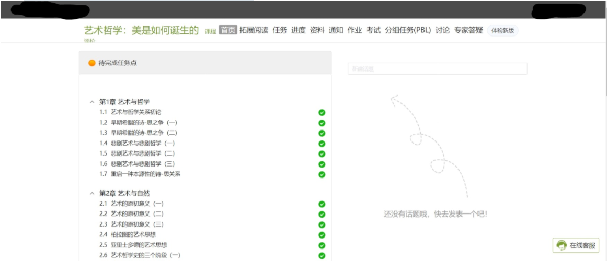
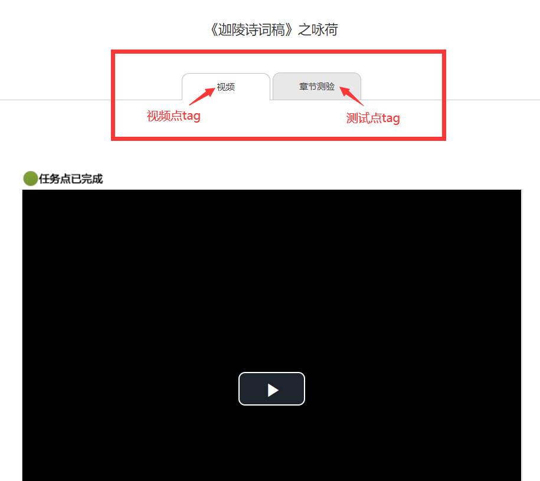

# XueXiTong
学习通泛雅课程刷课工具。使用selenium+python，破解了最近更新的测试复制乱码。能够自动进行视频播放与章节测试搜题、提交。


**求星~**


## 功能

1. 尔雅通识刷视频。 支持暂停自动继续、屏蔽视频中弹出题目，窗口可最小化

2. 章节测试。 支持破解测试复制乱码问题并使用CodFrm大神的题库（现有的总是最全的）

   

## 鸣谢

1. 测试复制乱码

   解决方法来源：[【新】【非OCR识别】学习通破解章节测试文字乱码思路-油猴中文网 (tampermonkey.net.cn)](https://bbs.tampermonkey.net.cn/thread-2190-1-1.html)

2. 题库

   https://cx.icodef.com/query.html

   使用了CodFrm大神插件中的网页版搜题功能

   [CodFrm/cxmooc-tools: 一个 超星(学习通)/智慧树(知到)/中国大学mooc 学习工具,火狐,谷歌,油猴支持.全自动任务,视频倍速秒过,作业考试题库,验证码自动打码(੧ᐛ੭挂科模式,启动) (github.com)](https://github.com/CodFrm/cxmooc-tools)


## 使用

### 如果你是个小白，只想摆烂

新加了pyinstaller导出的exe

下载 *打包exe* 文件夹，直接双击就能用。

P.S. 不保证都能用，打包不太靠谱。

P.S.S 电脑里要装有谷歌Chrome浏览器！！！


#### 一键运行.exe 使用说明：

**！！！！注目：url地址输入的是 旧版  超星网页网址。建议自己打开课程页面后复制！！！！**

示例：




**！！！！注目：因为多标签页各个课程数目与内容不同，添加了自定义事前输入！！！！**

如果没有如下图的多标签界面，可以随意输入不用管

示例：（如下图情况请输入 视频 章节测试）




#### 一键做题.exe 使用说明：

介于各位学习通课程模板千奇百怪，我做了一个专门用来做题的小程序来分流压力

**！！！！注目：url地址输入的是 旧版  超星网页网址（带题目）。建议自己打开题目页面后复制！！！！**

**安全模式：**

- 不会自动提交，会点暂时保存
- 会生成question.txt，文件中会保留搜题记录，方便你进行简单的答案对照

**！！！！注目：第一次使用请记得打开安全模式，你们自己老师导入的题库可能会有随机题目导致0分！！！！**


------

### 如果你会那么一点点Python（推荐）

你可以尝试自己去兼容那些奇奇怪怪的学习通课程（学校老师自己导入的课程）

**video_play() 函数：**只要你的自动化chrome浏览器在视频点网页。调用，他会帮你完成放视频和自动继续

**chapter_test()函数：**只要你的自动化chrome浏览器在有题目任务点的网页。调用，他会帮你完成搜题和答题

**求求各路大佬能够帮忙添加更多页面的兼容性QAQ**


## 环境

python3及以上

selenium库

```python
#selenium安装
pip install selenium
```

谷歌浏览器及其驱动（chromedriver.exe）

chromedriver.exe 我上传的版本是101.0.4951.41。

版本不对的话可以自己去[chromedriver.storage.googleapis.com/index.html](http://chromedriver.storage.googleapis.com/index.html)下个对的

## linux下的运行
```bash
nohup python3 -u XueXiTong_web.py "url" username password "视频" "章节测验" > out1.log 2>&1 &

```